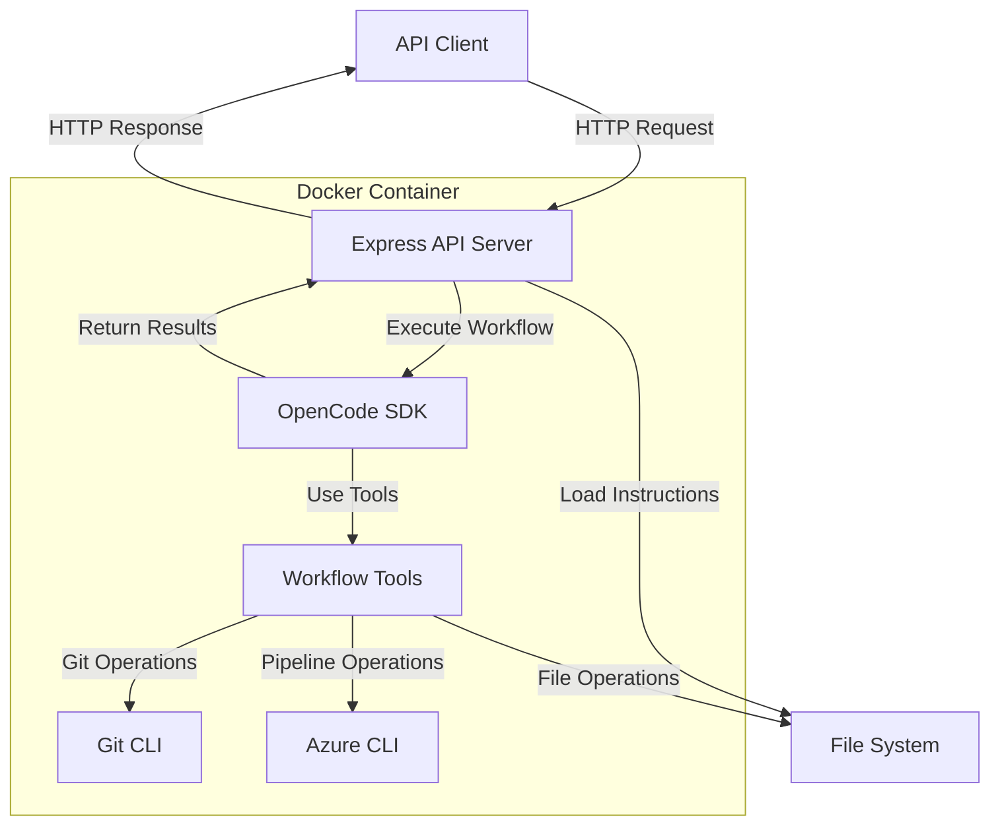

# Design Document

## Overview

The DevOps Automation system is a Node.js Express application that leverages the OpenCode SDK to execute automated DevOps workflows. The architecture is intentionally simple and extensible - each workflow is defined by an API endpoint and an instruction file that guides the OpenCode SDK through the automation steps.

The system follows a "instruction-driven automation" pattern where workflows are defined declaratively in markdown files rather than procedurally in code. This makes it easy to add new workflows, modify existing ones, and maintain the system over time.

### Key Design Principles

1. **Simplicity**: Adding a new workflow requires minimal code - just a route handler and an instruction file
2. **Declarative**: Workflows are defined in instruction files, not hardcoded logic
3. **Extensible**: New workflows can be added without modifying core infrastructure
4. **Observable**: All workflow execution is logged for debugging and monitoring
5. **Containerized**: The entire system runs in Docker for consistent deployment

## Architecture



### System Context

The DevOps Automation system operates as a standalone service that:
- Receives workflow requests via REST API
- Clones target repositories to a temporary workspace
- Executes workflows using OpenCode SDK with instruction files
- Interacts with Azure DevOps for pipeline monitoring
- Validates deployments on Azure resources
- Returns execution results to the caller

## Components and Interfaces

### 1. Express API Server

The main entry point that handles HTTP requests and orchestrates workflow execution.

**Responsibilities:**
- Expose REST API endpoints for each workflow
- Load instruction files from the filesystem
- Initialize OpenCode SDK sessions
- Handle authentication and authorization
- Manage workflow execution lifecycle
- Return results to clients

**Key Endpoints:**
```
POST /api/workflows/fix-vulnerabilities
  Body: { prompt: string, repositoryUrl: string, targetBranch?: string }
  Response: { executionId: string, status: string, result?: object }

GET /api/workflows/:executionId/status
  Response: { status: string, progress: string, logs: string[] }

GET /api/health
  Response: { status: "healthy", version: string }
```

**Interface:**
```javascript
class WorkflowController {
  async executeWorkflow(workflowName, userInput, options) {
    // Load instruction file
    // Initialize OpenCode session
    // Execute workflow
    // Return results
  }
  
  async getExecutionStatus(executionId) {
    // Query execution status
    // Return current state
  }
}
```

### 2. OpenCode SDK Integration

Wrapper around the OpenCode SDK that manages AI-powered workflow execution.

**Responsibilities:**
- Initialize OpenCode sessions with instruction files
- Provide workflow context (repository path, credentials, tools)
- Stream execution progress
- Handle errors and retries
- Manage session lifecycle

**Interface:**
```javascript
class OpenCodeExecutor {
  async createSession(instructionFile, context) {
    // Create OpenCode session
    // Load instruction file as system prompt
    // Configure available tools
  }
  
  async executeWithPrompt(sessionId, userPrompt) {
    // Send user prompt to OpenCode
    // Stream responses
    // Return final result
  }
  
  async getSessionLogs(sessionId) {
    // Retrieve execution logs
  }
}
```

### 3. CLI Tools and Scripts

The system leverages CLI tools for infrastructure operations, while OpenCode handles file editing directly.

**Responsibilities:**
- Provide pre-installed CLI tools in the Docker container
- Configure authentication for CLI tools
- Use CLI primarily for querying status and logs
- Let OpenCode SDK handle file reading and editing

**Pre-installed CLI Tools:**

```bash
# Git - for repository operations
git clone <repo>
git checkout -b <branch>
git add .
git commit -m "<message>"
git push origin <branch>

# Azure CLI - for querying Azure DevOps and resources
az login --service-principal -u $CLIENT_ID -p $CLIENT_SECRET --tenant $TENANT_ID

# Azure DevOps operations
az devops configure --defaults organization=<org> project=<project>
az repos pr create --source-branch <branch> --target-branch develop
az pipelines runs show --id <pipeline-id> --query "status"
az pipelines runs show --id <pipeline-id> --query "result"
az pipelines build list --branch <branch> --status inProgress

# Azure resource queries
az webapp show --name <app-name> --resource-group <rg> --query "state"
az webapp log download --name <app-name> --resource-group <rg>
az aks get-credentials --name <cluster> --resource-group <rg>

# Kubernetes operations
kubectl get pods -n <namespace> -l app=<app-name>
kubectl logs -n <namespace> -l app=<app-name> --tail=100
kubectl describe pod <pod-name> -n <namespace>
```

**Minimal Helper Scripts (only for complex parsing):**

```bash
# scripts/parse-vulnerability-prompt.sh
# Parse natural language prompt to extract structured vulnerability data
# Returns JSON: [{"package": "...", "currentVersion": "...", "targetVersion": "..."}]

# scripts/check-deployment-health.sh
# Check if deployment is healthy across different resource types
# Returns: "healthy" or "unhealthy" with details
```

**Design Rationale:**
- OpenCode SDK can read and edit files directly (no need for sed/awk scripts)
- Azure CLI is used only for querying status, logs, and creating PRs
- Git CLI for repository operations
- Simpler architecture with less custom code
- Easier to debug and maintain

### 4. Instruction File System

Markdown files that define workflow behavior for the OpenCode SDK.

**Structure:**
```
workflows/
├── fix-vulnerabilities-instructions.md
├── deploy-application-instructions.md
└── setup-monitoring-instructions.md
```

**Instruction File Format:**

Each instruction file contains:
1. **Workflow Overview**: What the workflow does
2. **Available Tools**: List of tools the workflow can use
3. **Step-by-Step Instructions**: Detailed steps to execute
4. **Error Handling**: How to handle common failures
5. **Success Criteria**: When to consider the workflow complete

**Example (fix-vulnerabilities-instructions.md):**
```markdown
# Vulnerability Fix Workflow

## Overview
This workflow automatically fixes security vulnerabilities in project dependencies by:
1. Analyzing the vulnerability prompt
2. Identifying affected dependency files
3. Updating package versions
4. Creating a PR
5. Monitoring pipeline and deployment
6. Iterating until success

## Available Tools

You can execute shell commands and read/edit files directly:

**File Operations (OpenCode built-in):**
- Read any file in the workspace
- Edit files directly (pom.xml, package.json, Dockerfile, etc.)
- Search for files and content

**CLI Tools (execute via shell):**
- **Git CLI**: git clone, git checkout, git commit, git push, etc.
- **Azure CLI**: az pipelines, az webapp, az aks (for querying status and logs)
- **kubectl**: For Kubernetes operations
- **Standard Linux tools**: find, grep, curl, jq, etc.

**Helper Scripts (in /app/scripts/):**
- parse-vulnerability-prompt.sh: Parse vulnerability information from natural language
- check-deployment-health.sh: Validate deployment health across resource types

## Execution Steps

### Step 0: Setup Workspace
Before starting, ensure the workspace is ready:
1. Create a unique workspace directory for this execution
2. Set up environment variables (Azure credentials, repo URL, etc.)

Execute:
```bash
EXECUTION_ID=$(date +%s)
WORKSPACE_DIR="/tmp/workflows/$EXECUTION_ID"
mkdir -p $WORKSPACE_DIR
```

### Step 1: Parse Vulnerability Information
Parse the user's prompt to extract:
- Package names
- Current versions
- Target/recommended versions
- Severity levels

Execute: `/app/scripts/parse-vulnerability-prompt.sh "$USER_PROMPT"`
This returns JSON with structured vulnerability data.

### Step 2: Clone Repository
Clone the target repository to the workspace directory.

Execute:
```bash
cd $WORKSPACE_DIR
git clone $REPO_URL repo
cd repo
git checkout $BASE_BRANCH  # Usually 'develop'
```

### Step 3: Identify Dependency Files
Search for all dependency files that might contain the vulnerable packages:
- pom.xml (Maven)
- package.json and package-lock.json (npm)
- Dockerfile

Execute:
```bash
find . -name "pom.xml" -o -name "package.json" -o -name "Dockerfile"
```

### Step 4: Update Dependencies
For each vulnerable package:
- Locate it in the dependency files
- Update to the recommended version directly in the file
- OpenCode can read and edit files directly

For Maven (pom.xml):
- Find the dependency block with matching groupId and artifactId
- Update the version tag

For npm (package.json):
- Update the version in the dependencies or devDependencies object
- Run `npm install` to update package-lock.json

For Dockerfile:
- Find the package reference and update the version

### Step 5: Create Branch and Commit
Create a new branch with pattern: ai/fix-vulnerabilities/<timestamp>
Commit all changes with a descriptive message listing fixed vulnerabilities.

Execute:
```bash
BRANCH_NAME="ai/fix-vulnerabilities/$(date +%s)"
git checkout -b $BRANCH_NAME
git add .
git commit -m "fix: Update vulnerable dependencies

- Updated package1 from 1.0.0 to 1.0.1
- Updated package2 from 2.0.0 to 2.1.0"
```

### Step 6: Push and Create PR
Push the branch and create a pull request to develop branch.
Include a summary of fixed vulnerabilities in the PR description.

Execute:
```bash
git push origin $BRANCH_NAME

az repos pr create \
  --source-branch $BRANCH_NAME \
  --target-branch develop \
  --title "fix: Automated vulnerability fixes" \
  --description "Fixed vulnerabilities: ..."
```

### Step 7: Monitor Pipeline
Wait for the Azure Pipeline to start and monitor its status.
Poll every 30 seconds until completion.

Execute:
```bash
# Get the latest pipeline run for the branch
PIPELINE_ID=$(az pipelines runs list \
  --branch $BRANCH_NAME \
  --status inProgress \
  --query "[0].id" -o tsv)

# Poll until complete
while true; do
  STATUS=$(az pipelines runs show --id $PIPELINE_ID --query "status" -o tsv)
  if [ "$STATUS" != "inProgress" ]; then
    break
  fi
  sleep 30
done
```

### Step 8: Handle Pipeline Failures
If the pipeline fails:
1. Retrieve pipeline logs
2. Analyze the logs to identify the root cause
3. If related to dependency changes, apply corrective fixes
4. Commit and push the fixes
5. Wait for the new pipeline run
6. Repeat up to 5 times

Execute:
```bash
RESULT=$(az pipelines runs show --id $PIPELINE_ID --query "result" -o tsv)

if [ "$RESULT" == "failed" ]; then
  # Get logs
  az pipelines runs show --id $PIPELINE_ID --query "logs" > pipeline-logs.txt
  
  # Analyze and fix (this is where OpenCode's AI helps)
  # Read the logs, understand the error, make fixes
  
  # Commit and push fixes
  git add .
  git commit -m "fix: Address pipeline failure"
  git push origin $BRANCH_NAME
fi
```

### Step 9: Validate Deployment
Once the pipeline succeeds:
1. Identify the deployment resource type (App Service or K8s)
2. Check health status
3. Retrieve application logs
4. Look for runtime errors

Execute:
```bash
# For App Service
az webapp show --name $APP_NAME --resource-group $RG --query "state" -o tsv
curl https://$APP_NAME.azurewebsites.net/health

# For Kubernetes
kubectl get pods -n $NAMESPACE -l app=$APP_NAME
kubectl logs -n $NAMESPACE -l app=$APP_NAME --tail=100

# Or use helper script
/app/scripts/check-deployment-health.sh $DEPLOYMENT_TYPE $RESOURCE_NAME
```

### Step 10: Handle Deployment Issues
If deployment validation fails:
1. Analyze application logs
2. Identify runtime errors
3. Apply corrective fixes to code
4. Commit and push
5. Wait for pipeline and revalidate

### Step 11: Complete Workflow
When both pipeline and deployment are successful:
1. Generate a summary report
2. List all fixed vulnerabilities
3. Report number of iterations
4. Mark workflow as complete

## Error Handling

### Authentication Errors
If Azure authentication fails, report the error clearly and halt execution.

### Git Errors
If Git operations fail (push, PR creation), retry once before failing.

### Maximum Iterations
If 5 fix iterations are reached without success, halt and report detailed diagnostics.

### Timeout
If pipeline monitoring exceeds 30 minutes, halt and report timeout.

## Success Criteria
The workflow is successful when:
1. All vulnerabilities are fixed in dependency files
2. Azure Pipeline completes successfully
3. Deployment resource is healthy
4. No runtime errors in application logs
```

### 5. Configuration Management

Environment-based configuration for credentials and settings.

**Environment Variables:**
```
# Azure Authentication
AZURE_CLIENT_ID=<app-registration-client-id>
AZURE_CLIENT_SECRET=<app-registration-secret>
AZURE_TENANT_ID=<azure-tenant-id>

# Azure DevOps
AZURE_DEVOPS_ORG=<organization-name>
AZURE_DEVOPS_PROJECT=<project-name>

# OpenCode SDK
OPENCODE_API_KEY=<api-key>

# Application
PORT=3000
NODE_ENV=production
LOG_LEVEL=info

# Workspace
WORKSPACE_ROOT=/tmp/workflows
MAX_CONCURRENT_WORKFLOWS=5
```

## Data Models

### WorkflowExecution

Represents a single workflow execution instance.

```javascript
{
  executionId: string,           // Unique identifier
  workflowName: string,          // e.g., "fix-vulnerabilities"
  status: string,                // "pending", "running", "success", "failed"
  startTime: Date,
  endTime: Date,
  userInput: {
    prompt: string,
    repositoryUrl: string,
    targetBranch: string
  },
  context: {
    workspacePath: string,
    branchName: string,
    prUrl: string,
    pipelineId: string
  },
  iterations: number,
  logs: string[],
  result: {
    success: boolean,
    summary: string,
    changes: string[],
    errors: string[]
  }
}
```

### WorkflowDefinition

Metadata about a workflow.

```javascript
{
  name: string,                  // "fix-vulnerabilities"
  displayName: string,           // "Fix Vulnerabilities"
  description: string,
  instructionFile: string,       // Path to instruction file
  endpoint: string,              // "/api/workflows/fix-vulnerabilities"
  requiredTools: string[],       // ["git", "azure-cli"]
  estimatedDuration: number      // Seconds
}
```

## Error Handling

### Error Categories

1. **Validation Errors** (400)
   - Missing required input fields
   - Invalid repository URL
   - Malformed prompt

2. **Authentication Errors** (401)
   - Invalid Azure credentials
   - Expired tokens
   - Missing API keys

3. **Workflow Execution Errors** (500)
   - Git operation failures
   - Azure CLI errors
   - OpenCode SDK errors
   - File system errors

4. **Timeout Errors** (504)
   - Pipeline monitoring timeout
   - Deployment validation timeout

### Error Response Format

```javascript
{
  error: {
    code: string,              // "VALIDATION_ERROR", "AUTH_ERROR", etc.
    message: string,           // Human-readable message
    details: object,           // Additional context
    timestamp: Date
  }
}
```

### Retry Strategy

- **Git operations**: Retry once with exponential backoff
- **Azure API calls**: Retry up to 3 times with exponential backoff
- **Pipeline polling**: Continue until timeout (30 minutes)
- **Workflow fixes**: Up to 5 iterations before failing

## Testing Strategy

### Unit Tests

Test individual components in isolation:

1. **Workflow Tools**
   - Mock Git CLI commands
   - Mock Azure CLI commands
   - Test file parsing and updating logic
   - Test error handling

2. **OpenCode Executor**
   - Mock OpenCode SDK responses
   - Test session management
   - Test error propagation

3. **Configuration**
   - Test environment variable loading
   - Test validation logic

### Integration Tests

Test component interactions:

1. **API Endpoints**
   - Test workflow execution flow
   - Test status queries
   - Test error responses

2. **Instruction File Loading**
   - Test file reading
   - Test template rendering

3. **Tool Integration**
   - Test Git operations in test repository
   - Test Azure CLI with test credentials

### End-to-End Tests

Test complete workflow execution:

1. **Vulnerability Fix Workflow**
   - Create test repository with known vulnerabilities
   - Execute workflow with test prompt
   - Verify PR creation
   - Mock pipeline responses
   - Verify final state

2. **Error Scenarios**
   - Test authentication failures
   - Test Git operation failures
   - Test pipeline failures
   - Test maximum iteration limit

### Manual Testing

1. Deploy to test environment
2. Execute real vulnerability fix workflow
3. Monitor Azure DevOps pipeline
4. Verify deployment validation
5. Review logs and results

## Security Considerations

### Credential Management

- Store Azure credentials in environment variables only
- Never log credentials or tokens
- Use Azure Managed Identity when possible
- Rotate credentials regularly

### Repository Access

- Use SSH keys or personal access tokens for Git operations
- Limit repository access to necessary permissions
- Clone repositories to isolated temporary directories
- Clean up workspaces after execution

### API Security

- Implement authentication for API endpoints
- Use HTTPS in production
- Rate limit API requests
- Validate all user input

### Container Security

- Use minimal base image (node:alpine)
- Run as non-root user
- Scan for vulnerabilities regularly
- Keep dependencies updated

## Performance Considerations

### Concurrency

- Limit concurrent workflow executions (default: 5)
- Use queue for pending workflows
- Implement timeout for long-running workflows

### Resource Management

- Clean up temporary workspaces after execution
- Limit workspace disk usage
- Monitor memory usage
- Implement graceful shutdown

### Caching

- Cache Git repository clones when possible
- Cache Azure CLI authentication tokens
- Cache instruction file reads

## Deployment

### Docker Image

```dockerfile
FROM node:18-alpine

# Install system dependencies
RUN apk add --no-cache git python3 py3-pip curl

# Install Azure CLI
RUN pip3 install azure-cli

# Set working directory
WORKDIR /app

# Copy package files
COPY package*.json ./

# Install dependencies
RUN npm ci --only=production

# Copy application code
COPY . .

# Create workspace directory
RUN mkdir -p /tmp/workflows && chown node:node /tmp/workflows

# Switch to non-root user
USER node

# Expose port
EXPOSE 3000

# Start application
CMD ["node", "server.js"]
```

### Environment Setup

1. Build Docker image
2. Configure environment variables
3. Deploy to container platform (Azure Container Instances, AKS, etc.)
4. Configure health checks
5. Set up logging and monitoring

### Monitoring

- Log all workflow executions
- Track success/failure rates
- Monitor execution duration
- Alert on authentication failures
- Track API response times

## Future Enhancements

### Potential New Workflows

1. **Deployment Workflow**
   - Deploy applications to various environments
   - Rollback on failure
   - Blue-green deployments

2. **Infrastructure Provisioning**
   - Create Azure resources via Terraform
   - Configure networking and security
   - Set up monitoring

3. **Database Migration**
   - Apply schema changes
   - Validate migrations
   - Rollback on errors

4. **Monitoring Setup**
   - Configure Application Insights
   - Set up alerts
   - Create dashboards

### Architecture Improvements

1. **Workflow Marketplace**
   - Share instruction files
   - Version control for workflows
   - Community contributions

2. **Advanced Scheduling**
   - Cron-based workflow execution
   - Event-driven triggers
   - Workflow chaining

3. **Enhanced Observability**
   - Distributed tracing
   - Metrics dashboard
   - Real-time progress streaming

4. **Multi-Repository Support**
   - Execute workflows across multiple repositories
   - Coordinate changes
   - Batch operations
